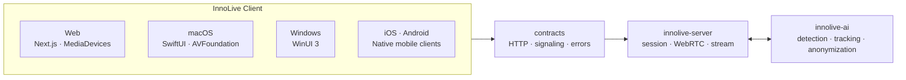

# InnoLive Client

InnoLive Client는 실시간 비식별화 방송 시스템의 플랫폼별 방송 스튜디오입니다.<br>
카메라·마이크·화면을 수집하고 방송 세션에 연결하며, 보호 처리된 영상의
미리보기와 방송 제어를 제공합니다.

얼굴 탐지·추적·비식별화는 [innolive-ai](https://github.com/team-framework/innolive-ai)가,
세션·시그널링·미디어 송출은 [innolive-server](https://github.com/team-framework/innolive-server)가 담당합니다.<br>
이 레포지토리는 각 운영체제의 권한, 장치, 미디어에 맞춘 클라이언트 구현을 담당합니다.

**웹에서 체험하기 —** [**innolive.chaeyn.com**](https://innolive.chaeyn.com/)

## 핵심 기능

- **플랫폼 네이티브 스튜디오** — Web, macOS, Windows, iOS, Android 환경에 맞는
  방송 제어 UI를 제공합니다.
- **미디어 입력 제어** — 카메라·마이크·화면 공유 장치를 선택하고 권한 상태와
  장치 변경을 처리합니다.
- **실시간 방송 연결** — 서버와 WebRTC 시그널링을 교환하고, 연결 상태와
  보호 처리된 미리보기를 사용자에게 표시합니다.
- **진행자 얼굴 등록** — 방송 보호 정책에 사용할 진행자 얼굴 등록 흐름을 제공하며,
  모델 추론과 식별 판정은 AI 서비스에 위임합니다.
- **계약 우선 통합** — 세션, 시그널링, 오류 vocabulary를 `contracts/`에서
  공유하여 플랫폼별 구현의 호환성을 유지합니다.

## 아키텍처



## 기술 스택

| 영역 | 구성 |
| --- | --- |
| Web | Next.js 16, React 19, TypeScript, Tailwind CSS, MediaPipe Tasks Vision |
| macOS | Swift, SwiftUI, AppKit, AVFoundation, ScreenCaptureKit, Vision |
| Windows | C#, WinUI 3, Windows App SDK |
| iOS | Swift, SwiftUI, AVFoundation |
| Android (예정) | Kotlin, Jetpack Compose |
| 공통 계약 | JSON Schema, fixture, compatibility 검증 스크립트 |

## 빠른 실행

### 1. Web 개발 서버

```bash
cd apps/web
npm ci
npm run dev
```

사전등록 데이터베이스까지 로컬에서 확인하려면 환경 파일을 만들고 DB 컨테이너를 실행해야 합니다.

```bash
cd apps/web
cp .env.local.example .env.local
docker compose -f docker-compose.yml -f docker-compose.local.yml up -d db
```

### 2. macOS 앱

Xcode에서 `apps/mac/InnoLive.xcodeproj`를 열고 `InnoLive` scheme을 실행합니다.
카메라·마이크·화면 공유 권한은 macOS에서 직접 허용해야 합니다.

### 3. Windows 앱

Windows에서 Visual Studio로
`apps/windows/InnoLive.Windows/InnoLive.Windows.csproj`를 열어 실행합니다.

### 4. iOS 앱

Xcode에서 `apps/ios/InnoLive/InnoLive.xcodeproj`를 열고 `InnoLive` scheme을
선택한 뒤, iOS Simulator 또는 연결된 기기에서 실행합니다.

## 공통 계약

`contracts/`는 모든 클라이언트와 서버가 같은 의미로 사용해야 하는 경계를 정의합니다.

- 방송 상태: `idle` → `connecting` → `live` → `stopping` 또는 `failed`
- WebRTC 시그널링: offer, answer, ICE candidate, 연결 상태
- 세션·방송 API payload, 오류 코드, compatibility fixture

## 프로젝트 구조

```text
apps/
├── web/        # Next.js 웹 체험 및 사전등록
├── mac/        # macOS SwiftUI 방송 스튜디오
├── windows/    # Windows WinUI 3 클라이언트
├── ios/        # iOS 클라이언트
└── android/    # Android 클라이언트

contracts/       # HTTP · WebRTC signaling schema, fixture, 오류 vocabulary
docs/            # 아키텍처, 플랫폼 매트릭스, 작업 명세
scripts/         # 공통 계약 검증
```

## 라이선스

InnoLive 자체 source code는 [Apache License 2.0](LICENSE)으로 배포합니다.

## Third-party notices

이 레포지토리에는 다음 제3자 소프트웨어와 자산이 포함됩니다.

- **MediaPipe Tasks Vision** 및 **BlazeFace short-range model** — Apache License 2.0
- **Wanted Sans** — SIL Open Font License 1.1
- Next.js, React, `pg`, `sharp` 등 각자의 라이선스로 배포되는 runtime dependency

전체 의존성·모델·폰트별 출처와 라이선스는
[THIRD_PARTY_NOTICES.md](THIRD_PARTY_NOTICES.md)에서 확인할 수 있습니다.
