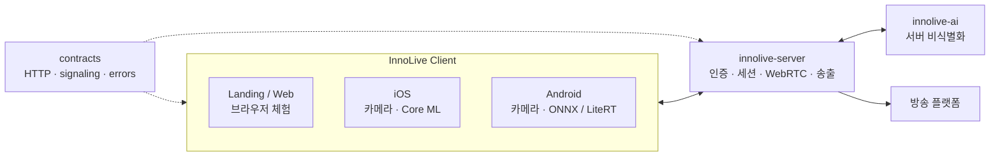

# InnoLive Client

InnoLive는 얼굴과 번호판을 실시간으로 비식별화하는 방송 서비스입니다.
이 저장소는 iOS·Android 방송 앱과 웹 사이트를 관리합니다. 각 클라이언트는
카메라·마이크 권한, 미디어 입력, 얼굴 등록, 방송 준비와 제어를 담당합니다.

모바일 앱은 서버 AI와 온디바이스 AI를 선택할 수 있습니다. 서버 AI는
[innolive-ai](https://github.com/team-framework/innolive-ai)가 처리하고,
온디바이스 AI는 기기에서 추론·비식별화한 영상을 전송합니다.
[innolive-server](https://github.com/team-framework/innolive-server)는
인증, 방송 세션, WebRTC 시그널링과 플랫폼 송출을 담당합니다.

[innolive.studio에서 체험하기](https://innolive.studio/)

## 앱 구성

| 경로 | 역할 | 기술 스택 |
| --- | --- | --- |
| `apps/landing` | 공개 사이트, 요금제, 이메일 인증, 게스트·회원 WebRTC 체험, 앱 다운로드 안내 | Next.js 16, React 19, TypeScript, Tailwind CSS, GSAP, MDX, MediaPipe |
| `apps/ios` | iOS 18.0 이상 방송 앱 | Swift, SwiftUI, AVFoundation, Vision, Core ML, WebRTC |
| `apps/android` | Android API 30 이상 방송 앱 | Kotlin, Jetpack Compose, CameraX, WebRTC, ONNX Runtime, LiteRT |
| `apps/web` | 기존 웹 체험·사전등록 구현 | Next.js 16, React 19, TypeScript, Tailwind CSS, MediaPipe, PostgreSQL |
| `apps/mac` | 지원 중단된 macOS 클라이언트 | Swift, SwiftUI, AppKit, AVFoundation, ScreenCaptureKit |
| `apps/windows` | 지원 중단된 Windows 클라이언트 | C#, WinUI 3, Windows App SDK |

현재 공개 사이트의 배포 대상은 `apps/landing`입니다.
랜딩의 라우트·인증·환경 설정은 [Landing README](apps/landing/README.md),
배포 절차는 [웹 배포 문서](docs/web-deployment.md)를 참고하세요.

## 주요 기능

- **AI 처리 방식 선택**: iOS·Android에서 서버 AI 또는 온디바이스 AI를 선택합니다.
  기본값은 서버 AI이며, 온디바이스 모드에서는 얼굴·번호판을 기기에서 비식별화합니다.
- **얼굴 등록과 관리**: 서버와 기기의 얼굴 목록을 구분해 등록·삭제하고,
  등록한 얼굴을 비식별화 예외로 사용합니다.
- **방송 준비와 제어**: 모바일 앱은 사용자가 방송 준비를 확정한 뒤 세션을 만들고
  WebRTC에 연결합니다. 준비 완료 후 방송 시작을 별도로 요청합니다.
  플랫폼별 연결·취소 동작은 [플랫폼 매트릭스](docs/platform-matrix.md)에 정리합니다.
- **카메라와 영상 조절**: 카메라 전환, 화질 선택, 노출·색온도·채도 조절,
  프리셋과 기기 지원 여부에 따른 손떨림 보정을 제공합니다.
- **방송 상태와 복구 안내**: 준비 단계, 연결 실패와 재연결 진행 상태를 표시합니다.
  iOS는 YouTube·치지직별 방송 설정과 라이브 방송 정보 수정도 제공합니다.
- **웹 체험**: 랜딩에서 한국어·영어·일본어 페이지와 게스트·회원 WebRTC 체험을 제공합니다.

플랫폼별 기능과 검증 범위는 아래 문서에서 확인할 수 있습니다.

| 주제 | iOS | Android |
| --- | --- | --- |
| AI 처리와 얼굴 등록 | [AI 설정·온디바이스 송출](docs/ios-ai-processing-settings.md) | [온디바이스 AI](docs/android-on-device-ai.md) |
| 연결과 방송 준비 | [연결·복구·세션 정리](docs/ios-connection-feedback.md) | [방송 준비](docs/android-broadcast-preparation.md) |
| 영상 조절 | [영상 조절](docs/ios-broadcast-video-controls.md) | [영상 조절](docs/android-broadcast-video-controls.md) |
| 방송 방향 | [방향 고정](docs/ios-broadcast-orientation.md) | [방향 고정](docs/android-broadcast-orientation.md) |

iOS의 [플랫폼별 방송 설정](docs/ios-broadcast-settings.md),
[라이브 방송 정보 수정](docs/ios-live-broadcast-editing.md),
[요금제·사용량](docs/ios-plan-usage.md),
[버전 지원](docs/ios-version-support.md)은 각 문서에 정리합니다.

## 아키텍처


```mermaid
flowchart LR
    subgraph Clients[InnoLive Client]
        Landing[Landing / Web\n브라우저 체험]
        iOS[iOS\n카메라 · Core ML]
        Android[Android\n카메라 · ONNX / LiteRT]
    end

    Contracts[contracts\nHTTP · signaling · errors]
    Server[innolive-server\n인증 · 세션 · WebRTC · 송출]
    AI[innolive-ai\n서버 비식별화]
    Platforms[방송 플랫폼]

    Clients <--> Server
    Contracts -.-> Clients
    Contracts -.-> Server
    Server <--> AI
    Server --> Platforms
```

iOS·Android 온디바이스 모드는 기기에서 처리한 영상을 WebRTC로 보냅니다.
이 모드도 방송 세션과 플랫폼 송출에는 서버를 사용합니다.
앱은 각 플랫폼의 UI·권한·미디어·보안 저장소를 구현하고,
`contracts/`는 API payload, 시그널링과 오류 코드를 정의합니다.
상세 경계는 [아키텍처](docs/architecture.md)를 참고하세요.

## 빠른 실행

### Landing

Node.js 24와 pnpm을 준비합니다. 저장소의 Landing Dockerfile은 pnpm 11.17.0을 사용합니다.

```bash
cd apps/landing
cp .env.example .env.local
pnpm install --frozen-lockfile
pnpm dev
```

`.env.local`의 `NEXT_PUBLIC_INNOLIVE_SERVER_URL`에 개발 서버 주소를 설정합니다.
로그인과 WebRTC 체험에는 서버의 인증·CORS·ICE/TURN 설정이 필요합니다.
게스트 체험은 서버의 게스트 대기열 설정도 필요하며,
세부 조건은 [Landing README](apps/landing/README.md)를 참고하세요.

앱 다운로드 메뉴는 `NEXT_PUBLIC_IOS_DOWNLOAD_URL`과
`NEXT_PUBLIC_ANDROID_DOWNLOAD_URL`을 사용합니다. 값을 설정하지 않으면 준비 중 안내를 표시합니다.

### iOS

Xcode에서 `apps/ios/InnoLive/InnoLive.xcodeproj`를 열고 `InnoLive` scheme과
iOS 18.0 이상 시뮬레이터 또는 기기를 선택합니다.

```bash
cp apps/ios/InnoLive/InnoLive/Config/Server.env.example \
  apps/ios/InnoLive/InnoLive/Config/Server.env
```

`Server.env`의 `INNOLIVE_SERVER_URL`에 개발 서버 주소를 설정합니다.
Xcode scheme의 실행 환경 변수로 같은 값을 지정할 수도 있습니다.
온디바이스 모드는 별도의 Core ML 모델 준비가 필요합니다.
[AI 설정 문서](docs/ios-ai-processing-settings.md)와 연결된 모델 변환 기록을 참고하세요.
시뮬레이터 영상 입력은 [미디어 소스 문서](docs/ios-simulator-media-source.md)에 정리합니다.

### Android

Android Studio에서 `apps/android/InnoLive` 폴더를 엽니다.
Gradle daemon은 JDK 21을 사용하며, compile SDK는 프로젝트의
`app/build.gradle.kts`에 지정된 버전을 설치합니다.

`apps/android/InnoLive/local.properties`에 Android SDK 경로와
`INNOLIVE_SERVER_URL`을 설정합니다. Google 로그인에는 `GOOGLE_WEB_CLIENT_ID`도 필요합니다.
`app` configuration과 API 30 이상 에뮬레이터 또는 기기를 선택해 실행합니다.
온디바이스 모델 준비는 [Android AI 문서](docs/android-on-device-ai.md)를 참고하세요.

### 기존 Web 앱

기존 웹 체험·사전등록 구현은 `apps/web`에서 실행합니다.
사전등록을 확인할 때는 로컬 DB도 시작합니다.

```bash
cd apps/web
cp .env.local.example .env.local
pnpm install --frozen-lockfile
docker compose -f docker-compose.yml -f docker-compose.local.yml up -d db
pnpm dev
```

## 공통 계약

[contracts/README.md](contracts/README.md)에서 버전별 계약과 fixture를 확인할 수 있습니다.

- 방송 상태: `idle` → `connecting` → `live` → `stopping` 또는 `failed`
- WebRTC 시그널링: offer, answer, ICE candidate, 인증·세션 소유권, ICE restart
- HTTP API: 방송 설정, AI 처리 방식, 얼굴 등록, 요금제·사용량, 계정 삭제
- UI, 카메라·마이크 권한과 보안 저장소는 각 앱에서 구현합니다.

## 프로젝트 구조

```text
apps/
├── landing/     # 공개 사이트 · 인증 · WebRTC 체험
├── ios/         # iOS 방송 앱
├── android/     # Android 방송 앱
├── web/         # 기존 웹 체험 · 사전등록
├── mac/         # macOS 클라이언트 (지원 중단)
└── windows/     # Windows 클라이언트 (지원 중단)

contracts/       # HTTP · WebRTC signaling 계약과 fixture
docs/            # 플랫폼별 동작과 검증 기록
scripts/         # 모델 변환 · 지역화 검증 · 배포 도구
```

## 라이선스

InnoLive 자체 소스 코드는 [Apache License 2.0](LICENSE)으로 배포합니다.
제3자 의존성·모델·폰트는 각 라이선스를 따릅니다.
출처와 라이선스 안내는 [THIRD_PARTY_NOTICES.md](THIRD_PARTY_NOTICES.md)에서 확인하세요.
