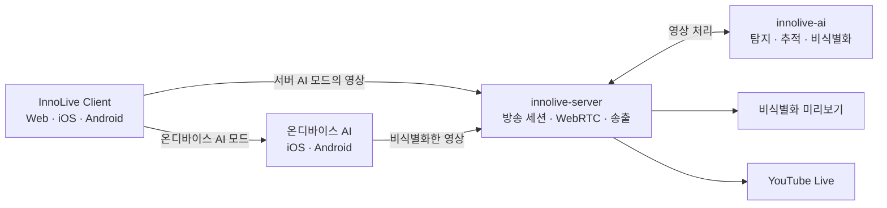

# InnoLive Client

InnoLive Client는 AI 기반 실시간 비식별화 방송 서비스 InnoLive의 웹·모바일 클라이언트입니다.
야외 방송과 현장 중계에서는 촬영에 동의하지 않은 행인의 얼굴도 화면에 노출됩니다.
방송자는 촬영에 동의한 인물을 미리 등록하고, 주변 인물의 얼굴과 차량 번호판을 가린 영상으로 방송할 수 있습니다.

웹에서는 설치 없이 비식별화 기능을 체험할 수 있습니다. iOS·Android 앱에서는
얼굴을 등록하고 카메라와 방송 정보를 설정해 라이브 방송을 준비합니다.

[innolive.studio에서 체험하기](https://innolive.studio/)

## 핵심 기능

- **선택적 비식별화**: AI가 영상 속 얼굴과 번호판을 탐지해 가립니다.
  미리 등록한 촬영 대상자의 얼굴은 비식별화 대상에서 제외합니다.
- **얼굴 등록과 관리**: 방송에 등장할 인물의 얼굴을 등록하고 삭제할 수 있습니다.
  모바일 앱은 서버에 등록한 얼굴과 기기에 보관한 얼굴을 구분해 관리합니다.
- **실시간 미리보기와 방송 제어**: 비식별화한 영상을 미리보기에서 확인하고,
  YouTube 방송 설정, 준비, 시작과 종료를 앱에서 제어합니다.
- **서버·온디바이스 AI**: iOS·Android에서 AI 처리 위치를 선택할 수 있습니다.
  온디바이스 모드는 기기에서 비식별화한 영상을 서버로 보내 송출합니다.
- **카메라와 영상 조절**: 전·후면 카메라 전환과 화질 선택, 노출·색온도·채도 조절,
  영상 프리셋과 기기가 지원하는 손떨림 보정을 제공합니다.
- **웹 체험과 다국어 지원**: 한국어·영어·일본어 웹사이트에서
  게스트 또는 회원으로 실시간 비식별화를 체험할 수 있습니다.

## 아키텍처


```mermaid
flowchart LR
    Client["InnoLive Client<br>Web · iOS · Android"]
    LocalAI["온디바이스 AI<br>iOS · Android"]
    Server["innolive-server<br>방송 세션 · WebRTC · 송출"]
    AI["innolive-ai<br>탐지 · 추적 · 비식별화"]
    Preview["비식별화 미리보기"]
    YouTube["YouTube Live"]

    Client -->|"서버 AI 모드의 영상"| Server
    Server <-->|"영상 처리"| AI
    Client -->|"온디바이스 AI 모드"| LocalAI
    LocalAI -->|"비식별화한 영상"| Server
    Server --> Preview
    Server --> YouTube
```

클라이언트는 카메라·마이크 입력, 얼굴 등록과 방송 제어를 담당합니다.
[innolive-server](https://github.com/team-framework/innolive-server)는 방송 세션과
영상 연결·송출을, [innolive-ai](https://github.com/team-framework/innolive-ai)는
서버에서의 얼굴 탐지·추적·비식별화를 담당합니다.
모바일 앱의 온디바이스 모드도 미리보기 연결과 방송 송출에는 서버를 사용합니다.

## 기술 스택

| 영역 | 구성 |
| --- | --- |
| Web | Next.js 16, React 19, TypeScript, Tailwind CSS, MediaPipe Tasks Vision, GSAP, MDX |
| iOS | Swift, SwiftUI, AVFoundation, Apple Vision, Core ML, WebRTC |
| Android | Kotlin, Jetpack Compose, CameraX, WebRTC, ONNX Runtime, LiteRT |
| macOS (지원 중단) | Swift, SwiftUI, AppKit, AVFoundation, ScreenCaptureKit, Apple Vision |
| Windows (지원 중단) | C#, WinUI 3, Windows App SDK |
| 공통 계약 | JSON Schema, fixture, compatibility 규칙 |

현재 Web·iOS·Android를 지원합니다.
macOS·Windows 코드는 이전 구현의 참조로 보존합니다.

## 빠른 실행

### 1. Web 체험

[innolive.studio](https://innolive.studio/)에서 게스트 또는 회원 체험을 선택하고,
카메라·마이크 사용을 허용하면 실시간 비식별화 미리보기를 확인할 수 있습니다.

### 2. iOS·Android 방송

앱에서 촬영 대상자의 얼굴을 등록하고 YouTube 계정을 연결합니다.
카메라와 방송 정보를 설정한 뒤 방송을 준비하고,
미리보기에서 비식별화 상태를 확인하고 방송을 시작합니다.

## 공통 계약

각 플랫폼의 화면과 카메라 제어는 별도로 구현합니다.
서버와 주고받는 API·WebRTC 시그널링 규약과 오류 코드는
`contracts/`에서 공유해 클라이언트 간 호환성을 관리합니다.

## 프로젝트 구조

```text
apps/
├── landing/     # 공개 웹사이트 · 인증 · WebRTC 체험
├── web/         # 기존 웹 체험 · 사전등록
├── ios/         # iOS 방송 앱
├── android/     # Android 방송 앱
├── mac/         # macOS 클라이언트 (지원 중단)
└── windows/     # Windows 클라이언트 (지원 중단)

contracts/       # API · WebRTC 시그널링 공통 규약
docs/            # 플랫폼별 기능과 검증 기록
```

## 라이선스

InnoLive 자체 소스 코드는 [Apache License 2.0](LICENSE)으로 배포합니다.

## Third-party notices

이 저장소에는 다음 제3자 소프트웨어와 자산이 포함됩니다.

- **MediaPipe Tasks Vision** 및 **BlazeFace short-range model**: Apache License 2.0
- **Wanted Sans**: SIL Open Font License 1.1
- Next.js, React, `pg`, `sharp` 등 각 라이선스로 배포되는 runtime dependency

의존성·모델·폰트별 출처와 라이선스는
[THIRD_PARTY_NOTICES.md](THIRD_PARTY_NOTICES.md)에서 확인할 수 있습니다.
