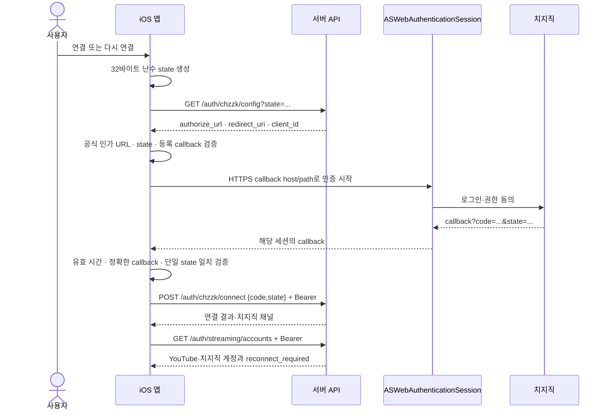

# iOS 치지직 OAuth와 송출 계정

## 변경 범위

- 대상: iOS 18 이상
- 경계: 계정 UI, 인증 브라우저 수명주기, 기존 서버 API 소비
- 이슈: [client#391](https://github.com/team-framework/innolive-client/issues/391)
- 시작 코드: `origin/main`의 `d9edf91`로 작업 브랜치 fast-forward
- HTTP·signaling 계약 변경 없음. [기존 계정 계약](../contracts/api/streaming-accounts-v1.md)과 fixture 추가
- YouTube 네이티브 Google SDK·인가 코드 교환·계정 해제 유지

## 변경 파일

| 범위 | 파일 |
| --- | --- |
| 인증·모델·API | `CHZZKAuthorization.swift`, `StreamingAccountModels.swift`, `YouTubeAPI.swift`, `YouTubeModels.swift` |
| 상태·화면 | `YouTubeIntegration.swift`, `BroadcastPlatformSelectionView.swift` |
| 앱 복귀·서명 | `Info.plist`, `InnoLive.entitlements`, `project.pbxproj` |
| 번역 | `Resources/CHZZK.xcstrings` |
| 테스트 | `CHZZKAuthorizationTests.swift`, `CHZZKAccountTests.swift` |
| 공통 명세·fixture | `contracts/README.md`, `contracts/api/streaming-accounts-v1.md`, `contracts/fixtures/streaming-accounts.v1.json`, `contracts/fixtures/chzzk-connect.v1.json` |
| 구현·검증 기록 | `docs/ios-chzzk-account.md` |

## 인증 순서



인가 code·state는 메모리에만 존재한다. HTTP 응답의 공급자 토큰을 앱에 저장하는 경로가
없으며 callback URL·인가 코드·NSError 원문을 로그에 출력하지 않는다. 서버 오류 메시지도
그대로 표시하지 않고 고정된 안내에 매핑한다. 인증 브라우저는 ephemeral 모드다.

state는 매 시도 생성하고 이전 값을 재사용하지 않는다. callback의 host·scheme·port·path,
중복 query, 빈 code, state 누락·불일치, fragment를 확인한다. state를 확인하기 전에
callback의 오류를 신뢰하지 않는다. 취소·실패·불일치·시간 만료에서는 POST하지 않는다.

5분은 **앱 인증 시도의 제한**이다. 공급자가 보장한 code 유효 기간을 의미하지 않는다.
`ContinuousClock`으로 판단하므로 기기의 날짜 변경에 좌우되지 않는다. 만료되면 브라우저를
닫는다. 서버의 `invalid_auth_code`는 만료·무효·재사용을 구분하지 못하는 응답이라 이들을
함께 안내하고 새 인증을 시작하게 한다.

## 복귀와 배포 조건

`ASWebAuthenticationSession`의 `.https(host:path:)`를 사용한다. 해당 API는 iOS 17.4부터
제공되므로 이 앱의 iOS 18 최소 버전에서 사용 가능하다. Google·Apple 로그인용 기존 URL
scheme과 Apple Sign In entitlement를 유지한다. 별도의 custom scheme 릴레이를 추가하지 않는다.

- `CHZZK_CALLBACK_HOST` 빌드 설정: 공급자에 등록되고 AASA가 제공되는 callback 호스트
- Info.plist의 `CHZZKCallbackHost`: 같은 빌드 설정에서 확장
- Associated Domains: `webcredentials:$(CHZZK_CALLBACK_HOST)`
- 런타임: config의 callback 호스트가 앱 설정과 다르면 브라우저를 열지 않음
- 서버 AASA: 실제 서명된 앱의 application-identifier와 같은 `webcredentials.apps` 필요
- Apple Developer App ID·provisioning profile: Associated Domains 권한 포함 필요

API 호스트와 callback 호스트는 같을 필요가 없다. API base URL을 callback 주소로 대체하지
않는다. 배포 도메인에 대한 실제 관측은 아래 검증 기록과 팀 위키의
`지식베이스/연동/02_치지직_연동_제약.md` §3-1,
`지식베이스/운영/04_포트_배치_지도.md` §4-3을 따른다.

공개 AASA·Apple CDN의 정상 응답과 서명된 앱 설치·실기기 인증 복귀는 별도의 확인 항목이다.
호스트나 bundle ID를 바꾸면 공급자 등록·AASA·빌드 설정·서명을 함께 다시 대조해야 한다.

## 계정 화면과 방송 사용 중 해제

화면 진입 시 공통 목록을 서버에서 조회한다. YouTube config가 404인 서버에서도 치지직 목록을
조회한다. 치지직 채널명·연결 상태·`reconnect_required`를 표시하고, 재연결도 같은 새 인증
흐름을 사용한다. 비어 있는 채널명은 channel ID로 표시한다.

연결·해제 성공 응답을 먼저 반영한 뒤 공통 목록을 다시 읽는다. 목록 재조회가 실패해도
이미 확인된 성공을 되돌리지 않는다. 조회·DELETE 실패는 계정을 지우지 않는다.
앱 재실행 시 치지직 연결을 일반 설정에서 복원하지 않고 서버 응답을 다시 사용한다.

해제에는 확인 대화상자가 있고 `/auth/streaming/accounts/chzzk`에 DELETE한다. 치지직
`targets[]`가 준비·대기·라이브·일시 중지 상태이거나 방식 전환 중이면 버튼과 실제 호출을
막는다. 알 수 없는 비 idle phase도 사용 중으로 본다. YouTube만 사용 중일 때는 치지직
해제를 허용한다. 다른 기기와의 경쟁 상황은 서버의 `streaming_account_in_use`를 안내한다.

계정 변경 중에는 다른 계정 작업과 새 방송 준비를 시작하지 않는다. 로그아웃·인증 사용자
변경으로 초기화되면 진행 중 브라우저를 닫고 늦은 callback·서버 응답은 세대 검사로 무시한다.

## 검증 방법

집중 테스트 대상:

- `CHZZKAuthorizationTests`: 난수 state, callback 검증, 취소·실패·불일치·만료
- `CHZZKAccountTests`: API 요청·응답·fixture, 두 플랫폼 공존, 재연결·해제, 요청 실패,
  서버 상태 재조회, 사용자 초기화, 방송 사용 차단, 화면 렌더링
- `YouTubeAccountAPITests`, `YouTubeIntegrationAccountTests`, `YouTubeModelsTests`
- `BroadcastSettingsTests`, `BroadcastSessionLifecycleTests`, `BroadcastPreparationFlowTests`

```sh
xcodebuild test -project apps/ios/InnoLive/InnoLive.xcodeproj -scheme InnoLive \
  -destination 'platform=iOS Simulator,name=iPhone 17 Pro' \
  -parallel-testing-enabled NO \
  -only-testing:InnoLiveTests/CHZZKAuthorizationTests \
  -only-testing:InnoLiveTests/CHZZKAccountTests \
  -only-testing:InnoLiveTests/YouTubeAccountAPITests \
  -only-testing:InnoLiveTests/YouTubeIntegrationAccountTests \
  -only-testing:InnoLiveTests/YouTubeModelsTests \
  -only-testing:InnoLiveTests/BroadcastSettingsTests \
  -only-testing:InnoLiveTests/BroadcastSessionLifecycleTests \
  -only-testing:InnoLiveTests/BroadcastPreparationFlowTests \
  SWIFT_EMIT_LOC_STRINGS=NO CODE_SIGNING_ALLOWED=NO
```

## 실기기·실계정 확인 경로

1. Associated Domains가 포함된 앱을 설치하고 두 플랫폼 계정 화면으로 진입한다.
2. 치지직을 연결하여 권한 동의 후 앱으로 돌아오는지, 서버 채널이 표시되는지 확인한다.
3. 새 연결에서 브라우저를 닫고 취소 메시지·기존 연결 유지 여부를 확인한다.
4. 브라우저를 5분 이상 열어 만료·종료를 확인하고, 새 시도에서 연결한다.
5. 재연결 필요 상태의 서버 계정으로 새 인증하고 상태가 해소되는지 확인한다.
6. 앱을 재실행해 서버 목록과 화면이 같은지, YouTube가 유지되는지 확인한다.
7. 치지직 준비·방송·일시 중지 중 해제 버튼 차단을 확인한다. 다른 기기에서 계정을
   사용 중인 경우 서버 `streaming_account_in_use` 안내와 계정 유지 여부를 확인한다.
8. 방송을 종료하고 치지직만 해제해 YouTube가 유지되는지 확인한다.

state 불일치·중복 callback query는 자동 테스트로 검증한다. 실제 code·토큰을 수동 검증용
URL이나 로그에 남기지 않는다. 실제 방송을 켜는 검증은 별도 사용자 동작으로 진행한다.

## 2026-10-01 검증 기록

- Xcode 26.6·iPhone 17 Pro Simulator·iOS 26.5에서 집중 테스트 실행
- 테스트·빌드는 기존 로컬 수정이 보존된 현재 작업 폴더 기준. 별도의 깨끗한 PR checkout 빌드와 구분
- 최종 집중 XCTest **100개 통과**, 실패·skip 없음. 신규 치지직 테스트 24개와 기존 회귀 테스트 76개 포함
- 시뮬레이터 앱·테스트 빌드 성공
- 기기용 Debug 서명 빌드 성공: `xcodebuild build ... -destination 'generic/platform=iOS' -allowProvisioningUpdates SWIFT_EMIT_LOC_STRINGS=NO`
- 기존 profile의 Associated Domains 누락으로 첫 서명 빌드 실패, 자동 profile 갱신 후 성공
- 기존 미디어 코드의 concurrency 경고·AppIntents metadata 추출 생략 경고는 남아 있음
- 밝은 화면의 연결 버튼·YouTube 공존과 어두운 화면의 큰 글씨 재연결·해제 버튼을 모의 API로 렌더링하여 PNG 확인
- 작업 시작 시 존재한 scheme·얼굴 등록 서비스·기존 번역 파일 2개의 SHA-256 동일 확인
- config callback URI와 공개 AASA·Apple CDN의 `webcredentials` 확인. 실제 인증 code 사용 없음
- 서명된 앱의 `application-identifier`: `SPT4X66Z4V.com.framework.innolive`, 운영 AASA의 `webcredentials.apps`와 일치
- 서명된 앱의 Associated Domains: `webcredentials:innolive.studio`, Info.plist의 callback host와 일치
- 갱신된 embedded provisioning profile에서 Associated Domains 허용 확인
- 최종 xcresult: `innolive-chzzk-focused-391-final.xcresult`, 화면 첨부 2개 포함
- 이번 작업의 diff whitespace 검사 통과. 작업 이전 얼굴 등록 서비스의 공백 오류는 수정하지 않음

실기기 치지직 인증 브라우저 복귀, 공급자 실계정 재연결·해제, 실제 송출, 실계정 앱 재실행은
아직 검증하지 않았다. 모의 API·화면 렌더링 결과로 이 항목을 완료 처리하지 않는다.

## 참고

- [치지직 공식 Authorization](https://chzzk.gitbook.io/chzzk/chzzk-api/authorization)
- [Apple HTTPS callback](https://developer.apple.com/documentation/authenticationservices/aswebauthenticationsession/callback/https(host:path:))
- [Apple Associated Domains](https://developer.apple.com/documentation/xcode/supporting-associated-domains)
- [server#377](https://github.com/team-framework/innolive-server/pull/377),
  [server#379](https://github.com/team-framework/innolive-server/pull/379): 서버 AASA·callback 배포 근거
